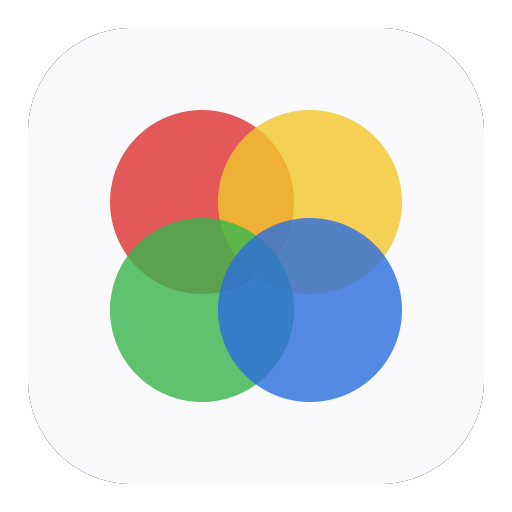

<div align="center">
  

  # QuickPaint

  A **touch-friendly** drawing & photo-editing app for macOS, written in
  **Rust** with **egui/eframe**. **100 % local** — no account, no cloud,
  no telemetry.
</div>

Designed to be as simple as Paint, with the core of PhotoFiltre (light photo
retouching) and Canva (fast composition), built on the architectural
foundations of the big editors: a tiled raster engine (GIMP/Photoshop),
always-editable vector objects (Illustrator), and non-destructive adjustments
(Photoshop).

Author: **Loïc Berthod** — <https://github.com/lberthod>

## Features

- **Drawing**: vector brush (width simulated from stroke speed **or real
  stylet/tablet pressure** when available, Catmull-Rom smoothing, adjustable
  **stroke stabilization**), plus a tiled **raster engine** with pixel
  **brush**, **eraser**, **clone stamp** (⌥+click = source), **healing
  brush**, a real flood-fill **paint bucket**, and one-click **cutout**
  (flood-fill + color-proximity soft edges) — all with per-tile undo. Named
  **brush presets** (built-in + import/export `.json`).
- **Local retouching tools**: **dodge/burn**, **sponge**
  (saturate/desaturate), localized **blur/sharpen**, **smudge**,
  **measure ruler**, rotational **mirror drawing**, drag-to-place
  **interactive gradient** (linear/radial/**conic**). One-click **cutout**
  has an optional **edge refinement** pass that preserves fine detail (hair,
  fur) instead of blurring it into the generic soft edge.
- **Shapes**: line, arrow, rectangle, ellipse, polygon, star (outline or
  filled, Shift constraint), with **linear/radial/conic gradient fills**.
- **Pen** (Bézier curves) with **node editing after the fact** — double-click
  a pen path to reopen and reshape its anchors/handles — and **path booleans**
  (union / subtract / intersect) on selected filled shapes.
- **Rich text**: system fonts (lazy-loaded), faux-bold, left/center/right
  alignment, outline, **drop shadow**, and **text on a curve**.
- **Selection**: click, **rectangle**, **ellipse**, **lasso**, **magic wand**
  (by color, contiguous or global); move, **resize**, **rotate**, duplicate,
  align / distribute (with **smart guides**/snapping), **z-order**,
  **copy/paste style**, named **style presets**, named **selections**
  (save/reload).
- **Layers**: visibility, opacity, **blend modes** (multiply, screen…),
  reordering, **groups**, **lock** (blocks painting/editing while keeping
  visibility/opacity/reordering available), merge / flatten, **clipping
  masks**, **painted layer masks**, non-destructive **adjustment layers**
  (levels, curves, hue/saturation, **exposure**, **vibrance**, **white
  balance**, brightness/contrast, sharpen, **denoise**, invert, grayscale,
  motion blur, bokeh, **real gaussian blur**, duotone, distortion, chromatic
  aberration, arc warp…), and non-destructive **layer styles** (drop shadow,
  stroke, outer/inner glow). Images keep their native pixel resolution
  decoupled from their displayed size, so resizing them down and back up
  stays lossless (a resolution badge in the layer panel flags it if you
  scale past native size).
- **Images**: import (PNG/JPG/BMP/GIF/WebP/**TIFF**) + **paste (⌘V)**, move,
  **crop** (free, ratio-constrained, or with **horizon straightening**),
  image & canvas **resize**, **perspective transform** (4-corner homography),
  content-aware **object removal**, **red-eye correction**, **skin
  smoothing**, **2×/3×/4× upscaling** (Lanczos3), filters, **before/after
  comparison** + live **RGB histogram** (whole canvas, or a selected image),
  **`.cube` LUT import**.
- **Import**: **Photoshop `.psd`** (multi-layer, blend modes mapped) as a new
  document.
- **Templates & assets**: built-in gallery of common formats (social posts,
  presentation, print…), embedded asset/picto library (hearts, speech
  bubbles, arrows, weather icons, gear, pin, home…), custom-sized documents.
- **Built-in documentation**: About ▸ Tool documentation opens a reference
  window covering every tool (matching icon, name, description) plus the
  project's philosophy (why QuickPaint, why touch-first, why Rust).
- **View**: touch zoom/pan, grid + snapping, **rulers**, fixed document size.
- **History**: non-linear (panel + jump straight to any state), automatic
  **crash recovery** (periodic autosave, restore prompt on next launch).
- **Export**: **PNG, JPEG (adjustable quality), WebP, PDF**, vector **SVG**,
  **batch multi-size export**, animated **GIF** and **APNG** (24-bit colors +
  alpha); **print** via ⌘P (vector PDF opened in Preview, which provides the
  native macOS print dialog); **project save** as `.json`.
- **Customization**: editable color palette, configurable keyboard shortcuts.
- **Languages**: **FR/EN** UI, detected from the system locale at launch
  (switchable anytime from the menu bar, preference persisted).

Not supported by design (see [audit_next.md](audit_next.md) and
[sprint_fonctionnalites.md](sprint_fonctionnalites.md) for the reasoning):
HEIC and camera RAW import (the only available Rust libraries are
AGPL/LGPL-licensed, incompatible with a simple standalone distribution),
lossy WebP export with an adjustable quality slider (would require the
`libwebp` system dependency; the `image` crate's encoder is lossless-only —
a deliberate trade-off, not an oversight), **PSD export** (no mature Rust
writer exists; a hand-rolled one is out of proportion with the outbound
interop need — PSD *import* is supported), **`.abr` third-party brush
import** (undocumented versioned Adobe binary format; importing an image as
a brush stamp covers the need), **MP4 video export** (would require a system
dependency such as ffmpeg — animated GIF/APNG cover the use case), and
ML-based background removal/super-resolution (replaced with heuristic
equivalents — color-proximity cutout edges, optional edge refinement for
fine detail, and Lanczos upscaling — to avoid bundling a neural network
model).

## Non-goals (by design)

No cloud sync, no real-time collaboration, no third-party API calls, no
telemetry. Everything works offline, on one machine, without an account.

## Install

Grab **QuickPaint.dmg** from the
[Releases page](https://github.com/lberthod/quickpaint/releases), open it and
drag **QuickPaint** to your Applications folder. Signed and notarized — no
Gatekeeper warning.

## Build & run from source

```bash
cargo run --release
```

Requires a recent stable Rust toolchain. Tests: `cargo test` (211 tests, no
window needed — the model, tools and history layers are UI-independent).

## Documentation

- [ARCHITECTURE.md](ARCHITECTURE.md) — layers, data model, input pipeline,
  rendering, undo/redo design.
- [CHANGELOG.md](CHANGELOG.md) — release history.
- [audit_next.md](audit_next.md) — latest functional audit against a product
  feature checklist (what's implemented, partial, or absent, with code
  references).
- [packaging/SANDBOX_NOTES.md](packaging/SANDBOX_NOTES.md) — Mac App Store
  sandbox validation notes.
- In-app: **About ▸ Tool documentation** — a reference window covering every
  tool and the project's design philosophy, in French.

Older planning/audit documents (feature roadmap, sprint-by-sprint logs, the
UI/UX audit, prior functional audits) are retired once acted upon — see the
git log for that history. Only the latest audit is kept at the repo root, to
avoid accumulating stale planning documents over time.

## License

MIT © Loïc Berthod — see [LICENSE](LICENSE).
